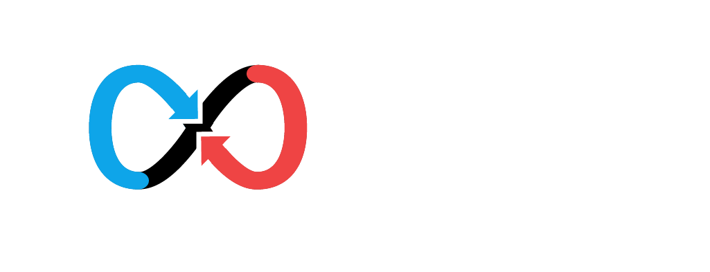
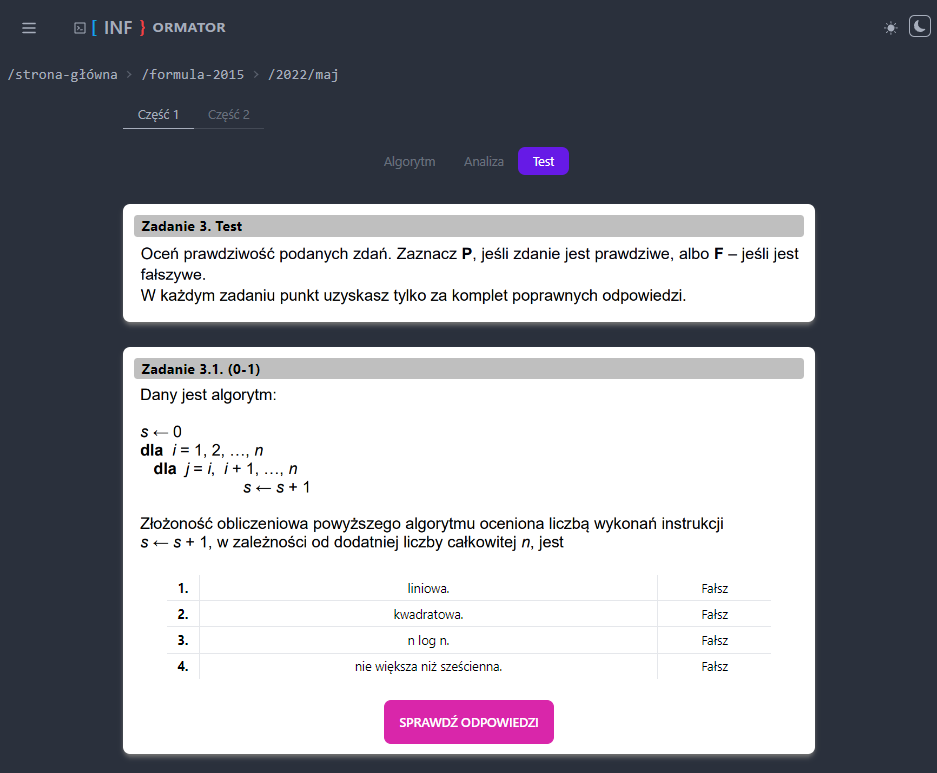
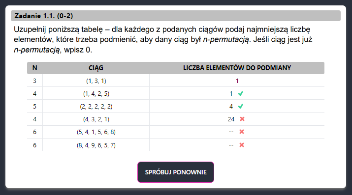
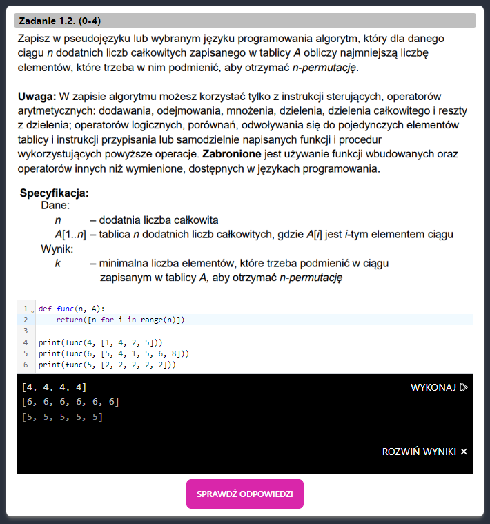

 
<h2>Project that helps high school graduates solve previous years' exams</h2>
 

 
---

## Tech-stack:

- 
Typescript 

- 
React 

- 
Redux 

- 
Redux Toolkit 

- 
React-Router 

- 
Tailwind 

- 
DaisyUI 

---

## LIVE Demo:

[INFormator](https://inf-ormator.vercel.app/)

---

## Demo:

- <b>App contains exam tasks that can be solved in the browser
  </b>
- <b>Once solved, the answers are checked
  </b>
- <b>There are also tasks that require writing a script in Python
   </b>

---

## I'm working on:

- UX/UI
- Storage of results in the database
- Auth system
- Larger task base
